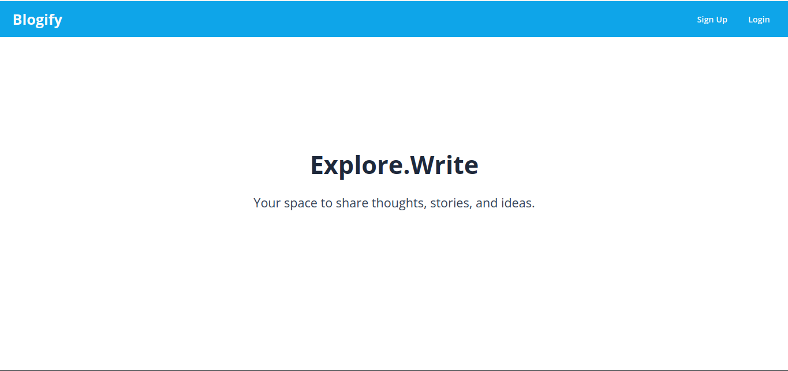
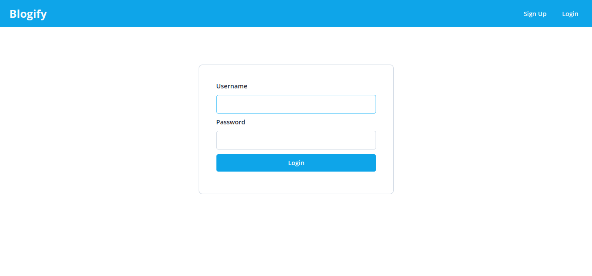
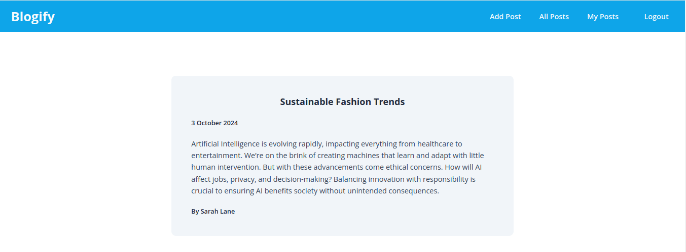

## Blogify - A Blogging Web Application

Blogify is a web application that allows users to register, log in and engage with the content by reading or writing blog posts. Users can create, read, update and delete (CRUD) blog posts. The application is build with a RESTful API architecture.

### Screenshots

<table>
    <tr>
        <th>Landing Page</th>
        <th>Login</th>
        <th>Posts</th>
        <th>My Posts</th>
    </tr>
    <tr>
        <td></td>
        <td></td>
        <td></td>
        <td></td>
    </tr>
</table>

### Features

- **Authentication**: Login functionality using hashed password with `bcrypt`

- **CRUD Operations**: Users can create a new posts, view posts by other users, and delete their own posts.

- **RESTful API**: The application follows REST principle for all CRUD operations, ensuring clear and structurd communication between the frontend and backend.

- **Database Integration with PostgreSQL**: Blogify uses PostgreSQL to store user information and blog posts.

### Technology Stack

- **Backend Framework**: Express.js
- **Frontend Templating Engine**: EJS (Embedded JavaScript)
- **Database**: PostgreSQL
- **Security**: `bcrypt` and `passport.js` for password hasing and user authentication
- **API**: RESTful API for data management
